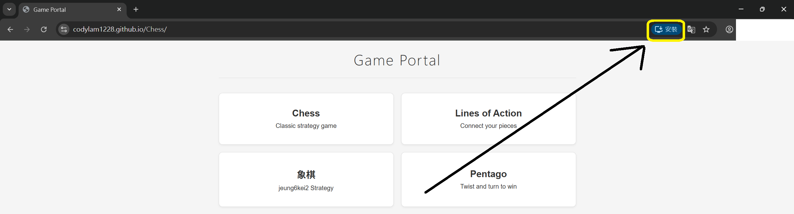
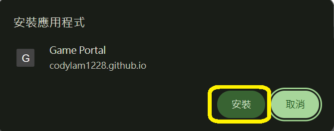

# Game Portal

A minimalist Progressive Web App (PWA) for playing board games locally. Hosted on GitHub Pages with offline support.

## System Design

### Architecture

The application follows a modular, event-driven architecture:

- **Entry Point**: `index.html` serves as the main entry point with a game selector portal
- **Game Modules**: Each game is self-contained in `src/games/{game-name}/`:
  - `logic.js`: Game state management, rules, and validation
  - `ui.js`: Rendering and user interaction handling
- **Styles**: Per-game CSS files in `src/styles/` with shared base styles
- **App Controller**: `src/scripts/app.js` handles game loading, routing, and lifecycle

### Technology Stack

- **Frontend**: Vanilla JavaScript (ES6+), HTML5, CSS3
- **PWA**: Service Worker for offline functionality
- **State Management**: In-memory game state (no backend required)
- **Hosting**: GitHub Pages (static hosting)

### Design Principles

- **Minimalist UI**: Clean, distraction-free interface
- **Modular Games**: Each game is independently implemented and can be added/removed easily
- **Consistent UX**: All games follow standard controls (Menu, Undo, Save, Load, Reset) and move highlighting
- **Offline-First**: Works without internet after initial load
- **Hotseat Multiplayer**: Two players share the same device

### Games

- **Chess**: Standard international chess
- **Lines of Action (LOA)**: Abstract strategy on 8x8 board
- **象棋 (jeung6kei2)**: Chinese Chess
- **Pentago**: 6x6 grid with rotating quadrants
- **\< add more if you want :) \>**

### Development Workflow

The project uses **OpenSpec** for planning and documenting significant changes. See `openspec/` directory for specifications and change proposals.

## How to use it

Simply open `index.html` in a modern browser. The app works offline after the first load.

### Screenshots

#### 📱 Mobile (Phone)

The following screenshots demonstrate the flow for deploying and using the app on a mobile device:

**Step 1:**

**Step 2:**

#### 💻 Desktop (PC)

The following screenshots demonstrate the flow for deploying and using the app on PC:

**Step 1:**

**Step 2:**

## License

MIT License

Copyright (c) 2025 Game Portal Contributors

Permission is hereby granted, free of charge, to any person obtaining a copy
of this software and associated documentation files (the "Software"), to deal
in the Software without restriction, including without limitation the rights
to use, copy, modify, merge, publish, distribute, sublicense, and/or sell
copies of the Software, and to permit persons to whom the Software is
furnished to do so, subject to the following conditions:

The above copyright notice and this permission notice shall be included in all
copies or substantial portions of the Software.

THE SOFTWARE IS PROVIDED "AS IS", WITHOUT WARRANTY OF ANY KIND, EXPRESS OR
IMPLIED, INCLUDING BUT NOT LIMITED TO THE WARRANTIES OF MERCHANTABILITY,
FITNESS FOR A PARTICULAR PURPOSE AND NONINFRINGEMENT. IN NO EVENT SHALL THE
AUTHORS OR COPYRIGHT HOLDERS BE LIABLE FOR ANY CLAIM, DAMAGES OR OTHER
LIABILITY, WHETHER IN AN ACTION OF CONTRACT, TORT OR OTHERWISE, ARISING FROM,
OUT OF OR IN CONNECTION WITH THE SOFTWARE OR THE USE OR OTHER DEALINGS IN THE
SOFTWARE.
